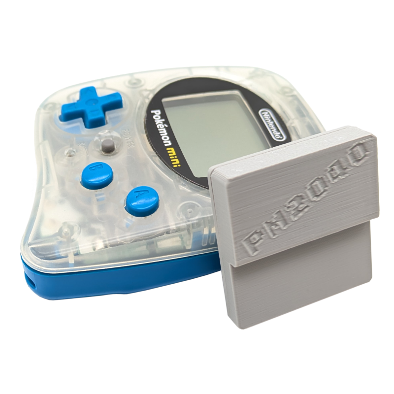
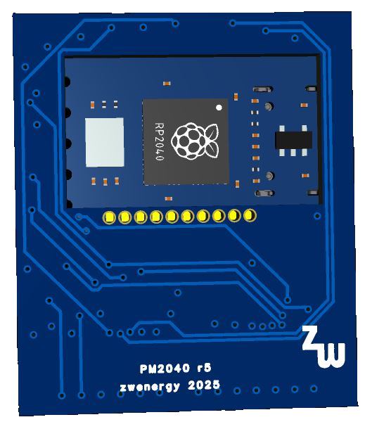

# PM2040
An RP2040-based Flash cart for the Pokemon mini handheld.
The RP2040 acts as the ROM chip of the cart.

## Software Side
In order to load a game onto the cartridge, you first have a "convert" a ROM to a UF2 file.

### Using the Online Patcher
You can use the [online patcher tool](https://zwenergy.github.io/PM2040ROMPatch/) to patch in a ROM into the ROM-less base UF2 firmware.
You can find the latest ROM-less base UF2 firmware in the releases tab.
Maximum ROM file size is currently 1048576 bytes (1 MB).

### Building a FW from Scratch

**Requirements:**
1. Python
2. CMake
3. RP2040 C SDK installed and paths set up

### Steps
1. Use the bin2c.py script to convert a ROM file to a C-array. Usage: `bin2c.py ROMFILE rom.h`. Place the genereated `rom.h` file in the root of code directory, beside main.c.
3. Run `make` in the code directory.
4. Connect the RP2040-Zero board to the computer while holding down the BOOT button.
5. Drag and drop the newly generated .uf2 file onto the RP2040-Zero.

## Hardware Side
### BOM
| **Reference** | **Value**| **Links**
|---------------|----------|----------|
| U3 | RP2040-Zero board (**not** with pre-soldered pin header) ||
| R1, R2 | 100 kOhm resistor (0805) |[LCSC](https://www.lcsc.com/product-detail/Chip-Resistor-Surface-Mount_YAGEO-RC0805FR-07100KL_C96346.html)|

**Note:** I would recommend to get an "authentic" WaveShare RP2040-Zero board and not a clone.
Clones may use different parts, e.g., different Flash chips, which could end up not working as the PM2040 is quite pushing the timings of the RP2040, as well as the Flash chip.
[See here](https://www.waveshare.com/wiki/RP2040-Zero#Anti-piracy_statement) for recommendations for spotting fakes.

### PCB
The PCB can be ordered using the Gerber files. A width of **1.0 mm** should be chosen with ENIG surface.

### Soldering up the RP2040-Zero Board
We do not only make use of the RP2040-Zero board's castellated edges, but also the small contact pads on the back.
These pads are rather small, so make sure to align the board correctly, such that the VIAs of the PCB line up with the pads.
It can also be helpful to pre-tin the RP2040-Zero's additional pad with a **thin** layer before actually soldering the pads via the through-holes.

## Shell
A 3D printable shell for the cart can be found in the folder "shell".

## Disclaimer
**Use the files and/or schematics to build your own board at your own risk**.
This board works fine for me, but it's a simple hobby project, so there is no liability for errors in the schematics and/or board files.
**Use at your own risk**.
